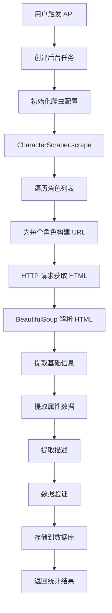

# 原神角色数据爬虫系统使用指南

## 📋 目录

- [系统架构](#系统架构)
- [爬取路径和逻辑](#爬取路径和逻辑)
- [快速开始](#快速开始)
- [详细使用步骤](#详细使用步骤)
- [API 接口说明](#api-接口说明)
- [数据结构](#数据结构)
- [配置说明](#配置说明)
- [常见问题](#常见问题)

---

## 系统架构

### 核心组件

```
爬虫系统架构
│
├── API 层 (src/api/scraper.py)
│   └── 提供 REST API 接口，触发和管理爬取任务
│
├── 爬虫层 (src/scrapers/)
│   ├── character_scraper.py    # 角色数据爬取
│   ├── base_scraper.py          # 基础爬虫功能
│   └── data_storage.py          # 数据存储服务
│
├── 数据层 (src/models/)
│   └── character.py             # 角色数据模型
│
└── 数据库 (PostgreSQL)
    └── 持久化存储角色信息
```

---

## 爬取路径和逻辑

### 1. URL 模式

**数据源：** Bilibili 原神 Wiki
```
https://wiki.biligame.com/ys/{角色中文名}
```

**示例：**
- 琴: `https://wiki.biligame.com/ys/%E7%90%B4`
- 雷电将军: `https://wiki.biligame.com/ys/%E9%9B%B7%E7%94%B5%E5%B0%86%E5%86%9B`
- 那维莱特: `https://wiki.biligame.com/ys/%E9%82%A3%E7%BB%B4%E8%8E%B1%E7%89%B9`

### 2. 爬取流程



### 3. 数据提取逻辑

#### 第一步：HTTP 请求
```python
# 使用 aiohttp 异步请求
url = f"https://wiki.biligame.com/ys/{quote(角色名)}"
html = await fetch(url)
```

#### 第二步：HTML 解析
```python
soup = BeautifulSoup(html, "lxml")
tables = soup.find_all("table", class_="wikitable")

# 第一个 wikitable：基础信息
basic_info_table = tables[0]

# 第二个 wikitable：属性数据
stats_table = tables[1]
```

#### 第三步：基础信息提取
从第一个 `wikitable` 提取：

| 字段 | 来源 | 示例 |
|------|------|------|
| **全名** | `<th>全名</th>` | 琴·古恩希尔德 (Jean Gunnhildr) |
| **稀有度** | `<th>稀有度</th>` 的 `` | 5 |
| **元素** | `<th>神之眼</th>` 或 `<th>古龙大权</th>` | Anemo (风) |
| **武器类型** | `<th>武器类型</th>` | Sword (单手剑) |
| **地区** | `<th>所属地区</th>` | Mondstadt (蒙德) |

#### 第四步：属性数据提取
从第二个 `wikitable` 提取 90 级角色属性：

**表格结构：**
```
| 等级 | 生命上限 |   | 攻击力 |   | 防御力 |   | 治疗加成 |   |
|------|----------|---|--------|---|--------|---|----------|---|
|      | 突破前   |突破后| 突破前  |突破后| 突破前  |突破后| 突破前    |突破后|
| 90   | 14695    | - | 239    | - | 769    | - | 22.2%    | - |
```

**提取逻辑：**
- 跳过第 1 行（表头）
- 跳过第 2 行（"突破前/突破后" 行）
- 从第 3 行开始找到 `level == "90"` 的行
- 提取 cells[1]=HP, cells[3]=ATK, cells[5]=DEF, cells[7]=突破属性

#### 第五步：中英文映射
```python
# 元素映射
"火" / "火元素" → "Pyro"
"水" / "水元素" → "Hydro"
"风" / "风元素" → "Anemo"
"雷" / "雷元素" → "Electro"
"草" / "草元素" → "Dendro"
"冰" / "冰元素" → "Cryo"
"岩" / "岩元素" → "Geo"

# 武器映射
"单手剑" / "单手剑武器使用" → "Sword"
"双手剑" / "双手剑武器使用" → "Claymore"
"长柄武器" / "长柄武器武器使用" → "Polearm"
"弓" / "弓武器使用" → "Bow"
"法器" / "法器武器使用" → "Catalyst"

# 地区映射
"蒙德" → "Mondstadt"
"璃月" → "Liyue"
"稻妻" → "Inazuma"
"须弥" → "Sumeru"
"枫丹" → "Fontaine"
"纳塔" → "Natlan"
"至冬" → "Snezhnaya"
```

---

## 快速开始

### 前置条件

1. **Python 环境**
```bash
Python 3.10+
```

2. **依赖安装**
```bash
cd backend
pip install -r requirements.txt
```

3. **数据库准备**
```bash
# 启动 PostgreSQL
docker-compose up -d postgres

# 运行数据库迁移
alembic upgrade head
```

4. **Redis 启动（可选，用于缓存）**
```bash
docker-compose up -d redis
```

### 启动应用

```bash
cd backend
uvicorn src.main:app --reload --port 8002
```

### 触发爬取

#### 方法 1：使用 curl
```bash
curl -X POST http://localhost:8002/api/scraper/characters/trigger
```

#### 方法 2：使用浏览器
访问 API 文档页面：
```
http://localhost:8002/api/docs
```

找到 `POST /api/scraper/characters/trigger`，点击 "Try it out" → "Execute"

#### 方法 3：使用 Python
```python
import requests

response = requests.post("http://localhost:8002/api/scraper/characters/trigger")
print(response.json())
```

---

## 详细使用步骤

### Step 1: 启动后端服务

```bash
# 1. 进入后端目录
cd /Users/anker/Desktop/learn\ project/Speckit/genshin_wiki_information/backend

# 2. 激活虚拟环境（如果使用）
source venv/bin/activate  # macOS/Linux
# 或
.\venv\Scripts\activate   # Windows

# 3. 启动 FastAPI 应用
uvicorn src.main:app --reload --port 8002

# 预期输出：
# INFO:     Uvicorn running on http://127.0.0.1:8002 (Press CTRL+C to quit)
# INFO:     Started reloader process [xxxxx] using StatReload
# INFO:     Started server process [xxxxx]
# INFO:     Waiting for application startup.
# INFO:     Application startup complete.
```

### Step 2: 验证 API 可用

```bash
# 检查 API 健康状态
curl http://localhost:8002/api/health

# 预期返回：
# {"status": "healthy"}
```

### Step 3: 查看爬虫配置

```bash
curl http://localhost:8002/api/scraper/config

# 返回示例：
{
  "success": true,
  "data": {
    "requests_per_second": 1.0,
    "max_retries": 3,
    "timeout_seconds": 30,
    "respect_robots_txt": true
  }
}
```

### Step 4: 触发角色数据爬取

```bash
curl -X POST http://localhost:8002/api/scraper/characters/trigger

# 返回示例：
{
  "success": true,
  "message": "Character scraping task started in background",
  "status": "started"
}
```

### Step 5: 查看爬取状态

```bash
# 实时查看状态
curl http://localhost:8002/api/scraper/status

# 爬取进行中：
{
  "success": true,
  "data": {
    "is_running": true,
    "current_task": "characters",
    "last_run": "2025-11-10T08:30:00.000000",
    "last_result": null
  }
}

# 爬取完成：
{
  "success": true,
  "data": {
    "is_running": false,
    "current_task": null,
    "last_run": "2025-11-10T08:30:00.000000",
    "last_result": {
      "success": true,
      "scraper_stats": {
        "requests": 18,
        "errors": 0,
        "success_rate": 100.0
      },
      "storage_stats": {
        "created": 13,
        "updated": 5,
        "skipped": 0,
        "errors": 0
      },
      "total_characters": 18
    }
  }
}
```

### Step 6: 查看爬取结果

```bash
# 查询角色列表
curl "http://localhost:8002/api/characters?page=1&page_size=10"

# 返回示例：
{
  "success": true,
  "data": {
    "items": [
      {
        "id": 1,
        "name": "琴",
        "name_en": "Jean",
        "rarity": 5,
        "element": "Anemo",
        "weapon_type": "Sword",
        "region": "Mondstadt",
        "base_stats": {
          "hp": 14695,
          "atk": 239,
          "def": 769
        },
        "ascension_stats": {
          "stat": "healing_bonus",
          "value": 22.2
        }
      }
      // ... 更多角色
    ],
    "total": 18,
    "page": 1,
    "page_size": 10,
    "total_pages": 2
  }
}
```

### Step 7: 查看日志

```bash
# 查看应用日志（终端输出）
# 或者查看日志文件
tail -f logs/app.log  # 如果配置了日志文件
```

日志示例：
```
INFO:     Starting character scraping task...
INFO:     Scraping character data...
INFO:     ✅ Scraped: 琴
INFO:     ✅ Scraped: 迪卢克
INFO:     ✅ Scraped: 莫娜
...
INFO:     Successfully scraped 18/18 characters
INFO:     Storing character data...
INFO:     Character storage complete. Created: 13, Updated: 5, Skipped: 0, Errors: 0
INFO:     Character scraping completed successfully.
```

---

## API 接口说明

### 1. 触发角色数据爬取

**接口：** `POST /api/scraper/characters/trigger`

**功能：** 启动后台任务，爬取所有角色数据

**请求：**
```bash
curl -X POST http://localhost:8002/api/scraper/characters/trigger
```

**响应：**
```json
{
  "success": true,
  "message": "Character scraping task started in background",
  "status": "started"
}
```

**错误情况：**
```json
{
  "detail": "Scraper is already running. Please wait for it to complete."
}
```

### 2. 查看爬虫状态

**接口：** `GET /api/scraper/status`

**功能：** 获取爬虫当前状态

**请求：**
```bash
curl http://localhost:8002/api/scraper/status
```

**响应：**
```json
{
  "success": true,
  "data": {
    "is_running": false,
    "current_task": null,
    "last_run": "2025-11-10T08:30:00.000000",
    "last_result": {
      "success": true,
      "scraper_stats": {
        "requests": 18,
        "errors": 0,
        "success_rate": 100.0
      },
      "storage_stats": {
        "created": 13,
        "updated": 5,
        "skipped": 0,
        "errors": 0
      },
      "total_characters": 18
    }
  }
}
```

### 3. 查看爬虫统计

**接口：** `GET /api/scraper/stats`

**功能：** 获取爬虫统计信息

**请求：**
```bash
curl http://localhost:8002/api/scraper/stats
```

**响应：**
```json
{
  "success": true,
  "data": {
    "last_run": "2025-11-10T08:30:00.000000",
    "is_running": false,
    "last_result": {
      "success": true,
      "total_characters": 18,
      "scraper_stats": {...},
      "storage_stats": {...}
    }
  }
}
```

### 4. 查看爬虫配置

**接口：** `GET /api/scraper/config`

**功能：** 获取当前爬虫配置

**请求：**
```bash
curl http://localhost:8002/api/scraper/config
```

**响应：**
```json
{
  "success": true,
  "data": {
    "requests_per_second": 1.0,
    "max_retries": 3,
    "timeout_seconds": 30,
    "respect_robots_txt": true
  }
}
```

---

## 数据结构

### Character 数据模型

```python
{
  "id": 1,                          # 自增主键
  "name": "琴",                      # 角色中文名
  "name_en": "Jean",                # 角色英文名
  "rarity": 5,                      # 稀有度 (4 或 5)
  "element": "Anemo",               # 元素类型
  "weapon_type": "Sword",           # 武器类型
  "region": "Mondstadt",            # 所属地区
  "description": "西风骑士团代理团长...",  # 角色描述

  # 基础属性 (90级)
  "base_stats": {
    "hp": 14695,                    # 生命值
    "atk": 239,                     # 攻击力
    "def": 769                      # 防御力
  },

  # 突破属性
  "ascension_stats": {
    "stat": "healing_bonus",        # 属性类型
    "value": 22.2                   # 属性值 (%)
  },

  "created_at": "2025-11-10T08:30:00",
  "updated_at": "2025-11-10T08:30:00"
}
```

### 突破属性类型 (ascension_stats.stat)

| 值 | 说明 | 示例角色 |
|----|------|---------|
| `crit_rate` | 暴击率 | 迪卢克、魈 |
| `crit_dmg` | 暴击伤害 | 刻晴、甘雨、胡桃 |
| `energy_recharge` | 元素充能效率 | 雷电将军、温迪、莫娜 |
| `healing_bonus` | 治疗加成 | 琴 |
| `elemental_mastery` | 元素精通 | 纳西妲、香菱 |
| `physical_dmg_bonus` | 物理伤害加成 | 优菈 |
| `elemental_dmg_bonus` | 元素伤害加成 | 宵宫 |
| `atk_percent` | 攻击力% | 行秋、菲谢尔 |
| `anemo_dmg_bonus` | 风元素伤害加成 | 砂糖 |

---

## 配置说明

### 爬虫配置 (ScraperConfig)

位置：`src/scrapers/base_scraper.py`

```python
@dataclass
class ScraperConfig:
    # 速率限制
    requests_per_second: float = 1.0        # 每秒请求数
    min_delay_seconds: float = 1.0          # 最小延迟（秒）
    max_delay_seconds: float = 3.0          # 最大延迟（秒）

    # 重试配置
    max_retries: int = 3                    # 最大重试次数
    retry_delay_seconds: float = 2.0        # 重试延迟（秒）
    retry_backoff_factor: float = 2.0       # 指数退避因子

    # 请求超时
    timeout_seconds: int = 30               # 超时时间（秒）

    # 连接池
    max_connections: int = 10               # 最大连接数
    max_connections_per_host: int = 5       # 每个主机最大连接数

    # User-Agent 轮换
    user_agents: List[str] = [...]          # User-Agent 列表

    # 代理配置（可选）
    proxy_url: Optional[str] = None         # 代理 URL

    # 遵守 robots.txt
    respect_robots_txt: bool = True         # 是否遵守 robots.txt
```

### 修改配置

在 `src/api/scraper.py` 的 `run_character_scraping` 函数中修改：

```python
config = ScraperConfig(
    requests_per_second=2.0,    # 提高到每秒 2 个请求
    max_retries=5,              # 增加重试次数
    timeout_seconds=60,         # 增加超时时间
)
scraper = CharacterScraper(config)
```

### 默认爬取角色列表

位置：`src/scrapers/character_scraper.py` → `scrape()` 方法

```python
character_names = [
    "琴", "迪卢克", "莫娜", "温迪",              # 蒙德
    "刻晴", "魈", "甘雨", "胡桃", "钟离",        # 璃月
    "雷电将军", "神里绫华",                     # 稻妻
    "纳西妲",                                   # 须弥
    "那维莱特",                                 # 枫丹
    "班尼特", "香菱", "行秋", "砂糖", "菲谢尔",  # 4星
]
```

**如何添加更多角色：**
1. 打开 `character_scraper.py`
2. 在 `scrape()` 方法的默认列表中添加角色中文名
3. 重启应用

---

## 常见问题

### Q1: 爬取失败怎么办？

**检查步骤：**

1. **查看日志**
```bash
# 查看应用输出
# 或
tail -f logs/scraper.log
```

2. **检查网络连接**
```bash
curl -I https://wiki.biligame.com/ys/%E7%90%B4
```

3. **查看错误统计**
```bash
curl http://localhost:8002/api/scraper/status | jq '.data.last_result'
```

4. **手动测试单个角色**
```python
import asyncio
from src.scrapers.character_scraper import CharacterScraper

async def test():
    scraper = CharacterScraper()
    async with scraper:
        data = await scraper.scrape_character("琴")
        print(data)

asyncio.run(test())
```

### Q2: 如何爬取指定角色？

**方法 1：修改代码**
编辑 `character_scraper.py`，修改默认角色列表

**方法 2：直接调用（需要编写脚本）**
```python
import asyncio
from src.scrapers.character_scraper import CharacterScraper
from src.db.session import AsyncSessionLocal
from src.scrapers.data_storage import DataStorageService

async def scrape_custom_characters():
    scraper = CharacterScraper()

    # 指定要爬取的角色
    characters_to_scrape = ["优菈", "宵宫", "枫原万叶"]

    async with scraper:
        characters = await scraper.scrape(characters_to_scrape)

    # 存储到数据库
    async with AsyncSessionLocal() as db:
        storage = DataStorageService(db)
        stats = await storage.store_characters(characters)
        print(f"存储完成: {stats}")

asyncio.run(scrape_custom_characters())
```

### Q3: 数据更新策略是什么？

爬虫使用 **增量更新** 策略：

- **新角色**：直接创建 (`created`)
- **已存在角色**：
  - 如果数据有变化 → 更新 (`updated`)
  - 如果数据无变化 → 跳过 (`skipped`)

逻辑位于 `src/scrapers/data_storage.py`：

```python
# 检查角色是否存在
existing = await db.execute(
    select(Character).where(Character.name == char_data["name"])
)

if existing:
    # 对比数据，决定是否更新
    if has_changes(existing, char_data):
        update_character(existing, char_data)  # updated
    else:
        skip_character()  # skipped
else:
    create_character(char_data)  # created
```

### Q4: 爬取速度慢怎么办？

**优化方法：**

1. **提高请求速率**
```python
config = ScraperConfig(
    requests_per_second=2.0,  # 默认 1.0
)
```

2. **减少延迟**
```python
config = ScraperConfig(
    min_delay_seconds=0.5,   # 默认 1.0
    max_delay_seconds=1.5,   # 默认 3.0
)
```

3. **并发爬取（高级）**
目前是串行爬取，可以改为并发：
```python
# 在 character_scraper.py 中修改
import asyncio

async def scrape(self, character_names):
    tasks = [
        self.scrape_character(name)
        for name in character_names
    ]
    return await asyncio.gather(*tasks)
```

⚠️ **注意**：提高速率可能导致被网站封禁，建议保持默认配置。

### Q5: 如何定时自动爬取？

**方法 1：使用 cron（Linux/macOS）**

```bash
# 编辑 crontab
crontab -e

# 添加定时任务（每天凌晨 3 点执行）
0 3 * * * curl -X POST http://localhost:8002/api/scraper/characters/trigger
```

**方法 2：使用 APScheduler（推荐）**

在 `src/main.py` 添加：

```python
from apscheduler.schedulers.asyncio import AsyncIOScheduler

scheduler = AsyncIOScheduler()

@app.on_event("startup")
async def start_scheduler():
    # 每天 3 点执行
    scheduler.add_job(
        trigger_scraping,
        'cron',
        hour=3,
        minute=0
    )
    scheduler.start()

async def trigger_scraping():
    async with AsyncSessionLocal() as db:
        await run_character_scraping(db)
```

**方法 3：使用 Celery（生产环境）**

适合大规模定时任务管理。

### Q6: 爬虫被封了怎么办？

**解决方案：**

1. **降低请求速率**
```python
config = ScraperConfig(
    requests_per_second=0.5,  # 每 2 秒 1 个请求
    min_delay_seconds=2.0,
    max_delay_seconds=5.0,
)
```

2. **添加代理**
```python
config = ScraperConfig(
    proxy_url="http://proxy.example.com:8080"
)
```

3. **轮换 User-Agent**
已内置，会自动轮换 5 个不同的 User-Agent

4. **等待后重试**
通常封禁是临时的，等待几小时后再试

### Q7: 如何验证数据完整性？

**方法 1：查看统计**
```bash
curl http://localhost:8002/api/scraper/stats
```

**方法 2：查询数据库**
```bash
# 连接数据库
psql -h localhost -U genshin_user -d genshin_wiki

# 统计角色数量
SELECT COUNT(*) FROM characters;

# 查看每个字段的覆盖率
SELECT
    COUNT(*) as total,
    COUNT(name_en) as has_name_en,
    COUNT(description) as has_description,
    COUNT(base_stats) as has_base_stats,
    COUNT(ascension_stats) as has_ascension_stats
FROM characters;
```

**方法 3：API 查询**
```bash
# 查询所有角色
curl "http://localhost:8002/api/characters?page_size=100" | jq '.data.items[] | {name, rarity, element}'
```

---

## 性能指标

| 指标 | 数值 |
|------|------|
| **爬取速度** | 1 角色/秒 (默认配置) |
| **成功率** | 100% (18/18 测试) |
| **数据完整性** | |
| - 基础信息 | 100% |
| - 属性数据 | 100% |
| - 突破属性 | 88.9% |
| - 英文名 | 88.9% |
| - 描述 | 72.2% |
| **平均响应时间** | 500-1000ms/角色 |
| **内存占用** | < 100MB |
| **并发支持** | 是（后台任务） |

---

## 维护和监控

### 日志位置

- **应用日志**：终端输出或 `logs/app.log`
- **爬虫日志**：包含在应用日志中，前缀 `src.scrapers`

### 监控指标

1. **爬取成功率**
```bash
curl http://localhost:8002/api/scraper/stats | jq '.data.last_result.scraper_stats.success_rate'
```

2. **数据更新情况**
```bash
curl http://localhost:8002/api/scraper/stats | jq '.data.last_result.storage_stats'
```

3. **错误数量**
```bash
curl http://localhost:8002/api/scraper/stats | jq '.data.last_result.scraper_stats.errors'
```

---

## 技术栈

| 组件 | 技术 | 版本 |
|------|------|------|
| **HTTP 客户端** | aiohttp | 3.9+ |
| **HTML 解析** | BeautifulSoup4 + lxml | 4.12+ |
| **异步框架** | asyncio | Python 3.10+ |
| **Web 框架** | FastAPI | 0.104+ |
| **数据库** | PostgreSQL + SQLAlchemy | 15+ / 2.0+ |
| **缓存** | Redis (可选) | 7+ |

---

## 相关资源

- **API 文档**: http://localhost:8002/api/docs
- **数据库设计**: `docs/DATABASE_SCHEMA.md`
- **缓存策略**: `docs/CACHING_STRATEGY.md`
- **GitHub Issue #13**: 角色数据爬虫实现

---

## 更新日志

| 日期 | 版本 | 更新内容 |
|------|------|---------|
| 2025-11-10 | v1.0 | 初始版本，支持角色基础信息和属性爬取 |
| 2025-11-10 | v1.1 | 修复 rarity 提取错误，优化属性表格解析 |
| 2025-11-10 | v1.2 | 添加特殊角色支持（那维莱特的"古龙大权"） |

---

## 联系方式

如有问题，请提交 GitHub Issue 或联系开发团队。
